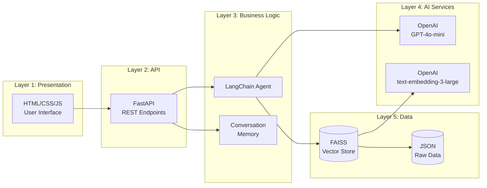
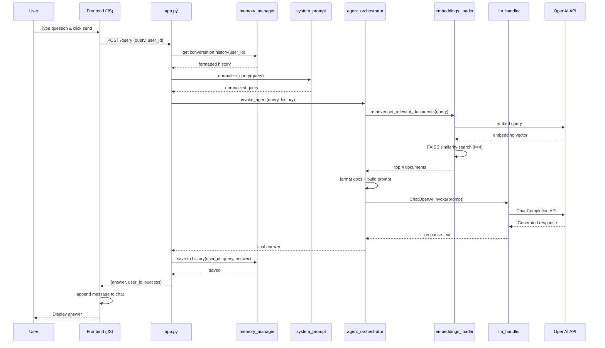
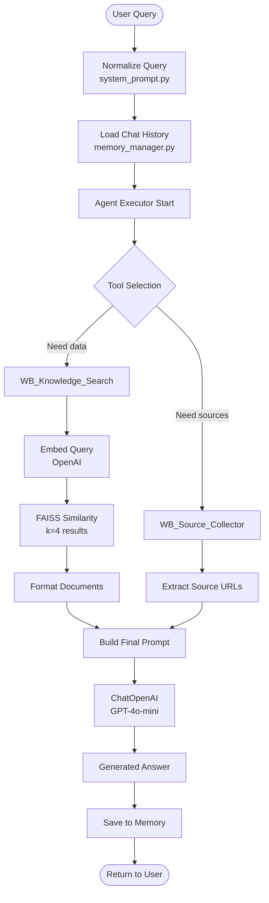
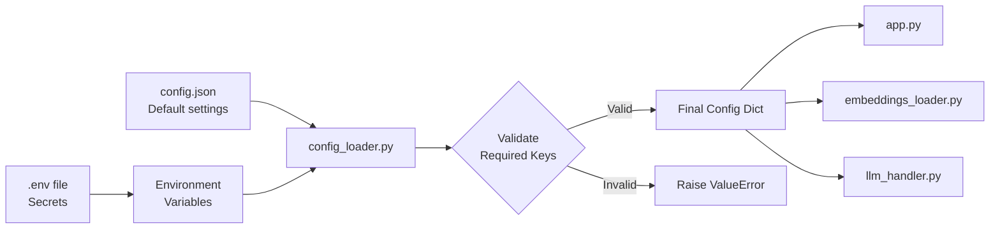
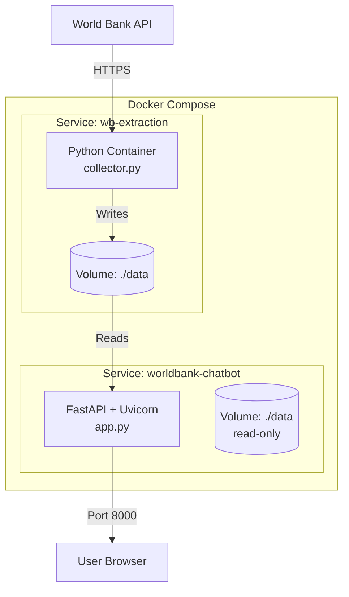
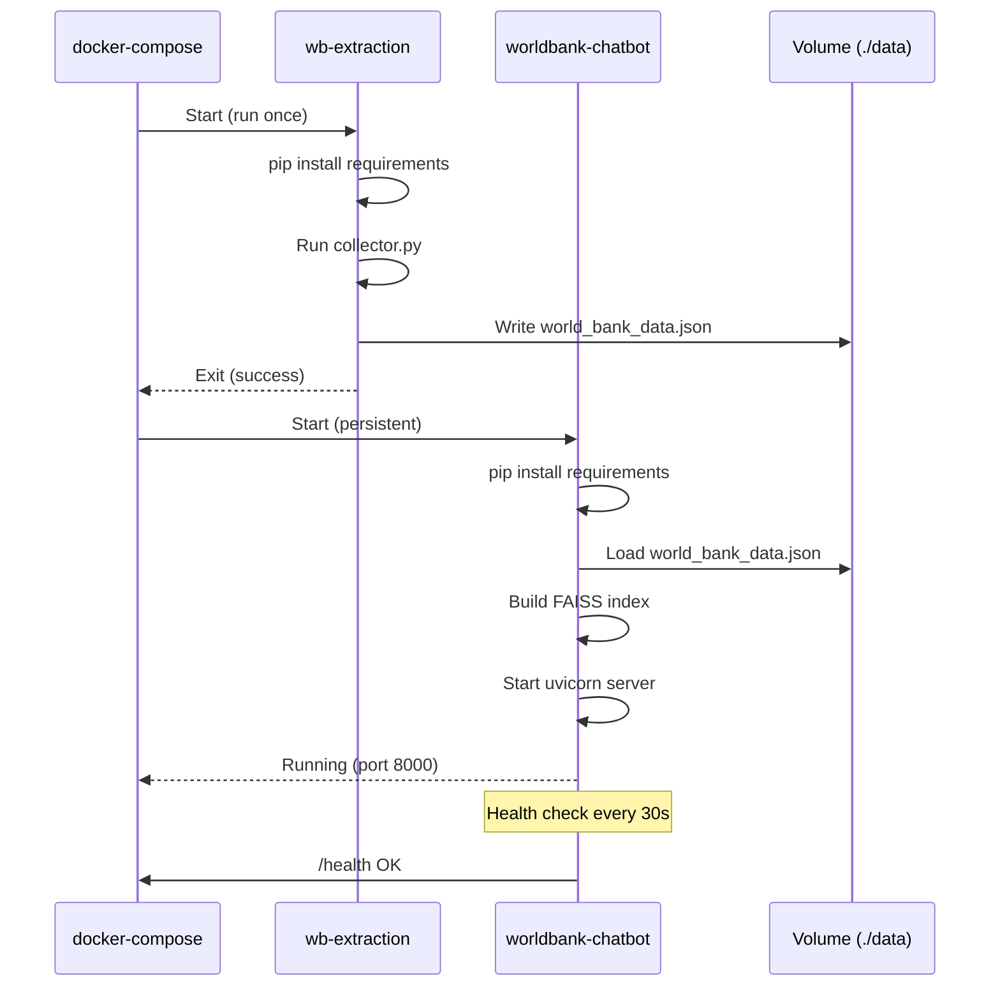
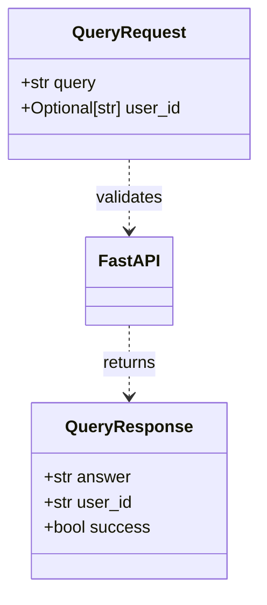
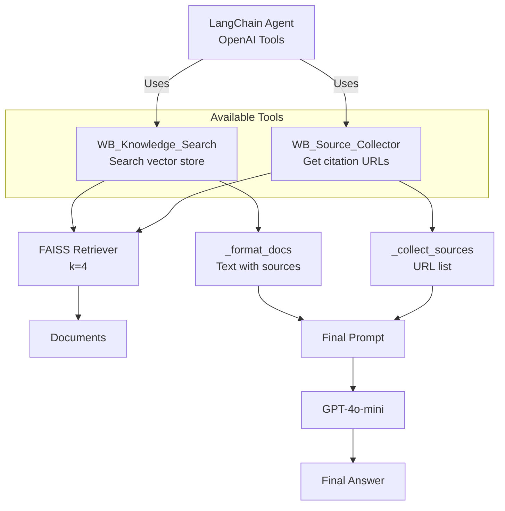
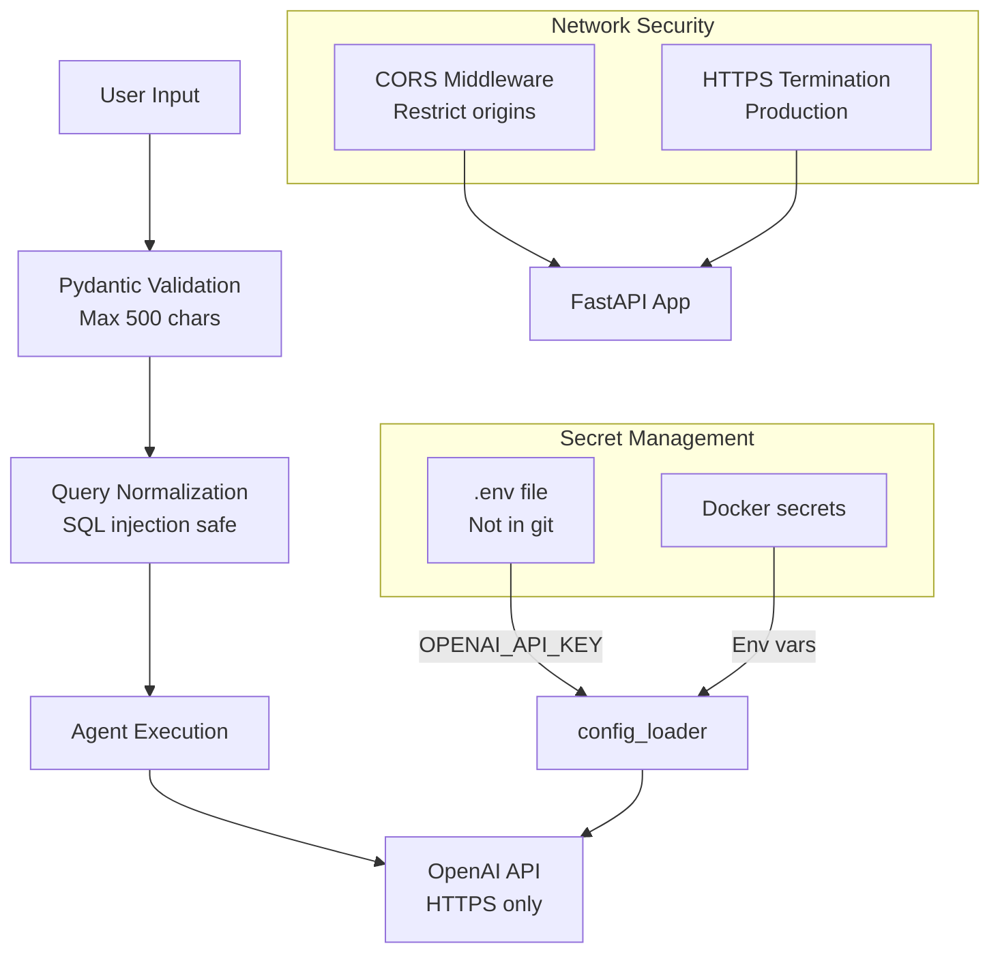
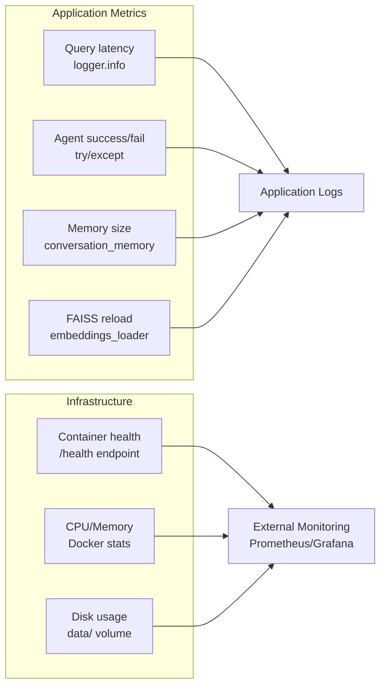

# Architecture - World Bank Chatbot

## 🏗️ Vue d'ensemble

Ce document présente l'architecture complète du chatbot World Bank avec des diagrammes visuels.

## 📊 Architecture Système

### Diagramme de flux complet

```mermaid
graph TB
    User[👤 User Browser]
    
    subgraph "Frontend"
        HTML[base.html<br/>Chat Interface]
        JS[app.js<br/>Event Handlers]
        CSS[style.css<br/>Styling]
    end
    
    subgraph "FastAPI Backend"
        App[app.py<br/>Main API]
        Routes{Routes}
        Query[/query endpoint]
        Health[/health endpoint]
    end
    
    subgraph "Core Logic"
        Config[config_loader<br/>Settings]
        LLM[llm_handler<br/>GPT-4o-mini]
        Memory[memory_manager<br/>Conv History]
        Agent[agent_orchestrator<br/>RAG Agent]
        Prompt[system_prompt<br/>Instructions]
    end
    
    subgraph "Vector Store"
        Embeddings[embeddings_loader<br/>FAISS Manager]
        FAISS[(FAISS Index<br/>4096 dims)]
    end
    
    subgraph "Data Source"
        Collector[collector.py<br/>WB API Client]
        Processor[processors.py<br/>Chunking]
        WBAPI[World Bank API v2]
        Data[(world_bank_data.json)]
    end
    
    User -->|HTTP GET /| HTML
    HTML --> JS
    JS -->|POST /query| App
    App --> Routes
    Routes --> Query
    Routes --> Health
    
    Query --> Config
    Query --> Memory
    Query --> Agent
    
    Agent --> LLM
    Agent --> Embeddings
    Agent --> Prompt
    
    Embeddings --> FAISS
    FAISS -.->|Load from| Data
    
    Collector -->|Fetch| WBAPI
    Collector --> Processor
    Processor -->|Save| Data
    
    Agent -->|Response| Query
    Query -->|JSON| JS
    JS -->|Display| HTML
```

### Architecture en couches



## 🔄 Flux de traitement d'une query

### Séquence complète



### Traitement agent (détail RAG)



## 🗄️ Structure de données

### Format world_bank_data.json

```json
{
  "indicators": [
    {
      "code": "NY.GDP.MKTP.CD",
      "name": "GDP (current US$)",
      "source": "World Development Indicators",
      "source_url": "https://data.worldbank.org/indicator/NY.GDP.MKTP.CD",
      "description": "Gross domestic product...",
      "methodology": "GDP at purchaser's prices...",
      "chunks": [
        {
          "text": "Chunk 1 of methodology (max 1000 chars)",
          "chunk_index": 0
        }
      ]
    }
  ],
  "country_data": [
    {
      "indicator_code": "NY.GDP.MKTP.CD",
      "country_code": "FRA",
      "country_name": "France",
      "year": 2023,
      "value": 2782000000000,
      "source_url": "https://data.worldbank.org/...",
      "snippet": "France GDP in 2023: $2.78 trillion USD"
    }
  ]
}
```

### Structure FAISS Index

```
data/faiss_index/
├── index.faiss          # Vector index (binary)
└── index.pkl            # Metadata (docstore, index_to_docstore_id)
```

**Documents dans FAISS**:
- **page_content**: Texte du chunk ou snippet
- **metadata**:
  - source: URL World Bank
  - category: "indicator" | "country_data" | "methodology"
  - type: "metadata" | "data_point" | "methodology_chunk"
  - indicator_code: ex. "NY.GDP.MKTP.CD"
  - country_code: ex. "FRA" (si data_point)
  - year: ex. 2023 (si data_point)

## 🔧 Configuration Flow



**Priority**: Environment Variables > .env > config.json

## 🐳 Architecture Docker

### Multi-service setup



### Container lifecycle



## 📡 API Flow

### Endpoints

```mermaid
graph LR
    subgraph "FastAPI Routes"
        Root[GET /<br/>HTML Page]
        Query[POST /query<br/>Chat Logic]
        Health[GET /health<br/>Status Check]
        Static[/static/*<br/>CSS/JS]
    end
    
    Browser[User Browser] -->|Navigate| Root
    Browser -->|Fetch| Static
    Browser -->|POST JSON| Query
    Monitor[Docker/K8s] -->|Health probe| Health
    
    Root --> Templates[Jinja2<br/>base.html]
    Query --> CoreLogic[core/<br/>modules]
    Health --> ConfigCheck[Check config<br/>loaded]
```

### Request/Response Models



## 🧠 Agent Tools Architecture



## 🔄 Memory Management

```mermaid
graph LR
    subgraph "conversation_memory dict"
        User1[user_id_1:<br/>{history, last_active}]
        User2[user_id_2:<br/>{history, last_active}]
        User3[user_id_n:<br/>{history, last_active}]
    end
    
    Query[New Query] -->|Get/Create| User1
    User1 -->|Build prompt| ChatHistory[Formatted History]
    
    Answer[Agent Answer] -->|Save| User1
    User1 -->|Update| LastActive[last_active = now()]
    
    Cleanup[Cleanup Task<br/>Every 60s] -->|Check timeout| User2
    User2 -.->|Inactive > 5min| Delete[Remove session]
```

## 🔐 Security Layers



## 📊 Monitoring Points



---

## 🎯 Résumé Architecture

### Stack technique
- **Frontend**: HTML5 + Vanilla JS + CSS3
- **Backend**: FastAPI (Python 3.11+)
- **AI**: LangChain + OpenAI (GPT-4o-mini, text-embedding-3-large)
- **Vector DB**: FAISS (CPU)
- **Data Source**: World Bank API v2
- **Container**: Docker + Docker Compose
- **Deployment**: Uvicorn (dev), Gunicorn+Uvicorn (prod)

### Design patterns
- **RAG (Retrieval Augmented Generation)**: Combine retrieval + generation
- **Microservices**: Extraction service + Chatbot service separated
- **Repository Pattern**: config_loader, embeddings_loader encapsulent la logique
- **Dependency Injection**: Config passed to all modules
- **Circuit Breaker**: Retry mechanism avec tenacity

### Scalability considerations
- **Horizontal**: Deploy multiple FastAPI instances behind load balancer
- **Vertical**: Increase k in FAISS, larger context windows
- **Caching**: Add Redis for conversation memory (current: in-memory)
- **Database**: Migrate to PostgreSQL with pgvector for production vector search

---

📚 **Voir aussi**: [README.md](README.md) pour installation détaillée
