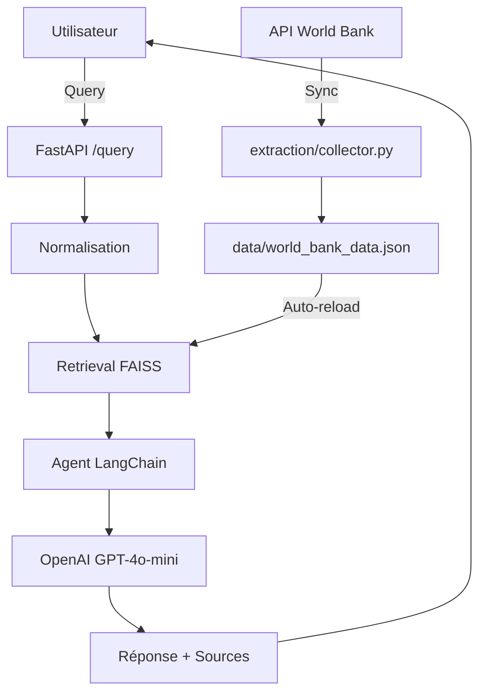

# 🌍 Chatbot World Bank Data - Projet Portfolio


> **Assistant conversationnel intelligent pour explorer les données de la Banque Mondiale**  
> Propulsé par RAG (Retrieval Augmented Generation), OpenAI GPT-4o-mini et FAISS

---

## 📖 Table des Matières

- [Vue d'Ensemble](#-vue-densemble)
- [Fonctionnalités Principales](#-fonctionnalités-principales)
- [Architecture](#-architecture)
- [Installation](#-installation)
- [Configuration](#%EF%B8%8F-configuration)
- [Utilisation](#-utilisation)
- [Structure du Projet](#-structure-du-projet)
- [API World Bank](#-api-world-bank)
- [Déploiement](#-déploiement)
- [Tests](#-tests)
- [Roadmap](#-roadmap)

---

## 🎯 Vue d'Ensemble

### Qu'est-ce que ce Projet ?

Le **Chatbot World Bank Data** est un système intelligent conçu pour :
- ✅ Interroger en langage naturel les indicateurs de développement mondial
- ✅ Fournir des données économiques, sociales et environnementales par pays
- ✅ Citer systématiquement les sources et périodes temporelles
- ✅ Maintenir une mémoire conversationnelle contextuelle
- ✅ Se synchroniser automatiquement avec l'API World Bank

### Cas d'Usage Principaux

- 📊 **Recherche d'indicateurs** : "Quel est le PIB de la France en 2023 ?"
- 🌐 **Comparaisons internationales** : "Compare le taux de chômage entre l'Allemagne et l'Espagne"
- 📈 **Tendances temporelles** : "Évolution de la population au Japon depuis 2000"
- 📚 **Méthodologies** : "Comment est calculé l'indice de développement humain ?"
- 🔍 **Découverte** : "Quels indicateurs environnementaux sont disponibles pour le Brésil ?"

---

## ✨ Fonctionnalités Principales

### 1. Retrieval Augmented Generation (RAG)
- Indexation FAISS des métadonnées, définitions et données numériques
- Récupération contextuelle des passages pertinents (top-k=4)
- Génération de réponses avec citations systématiques

### 2. Normalisation Intelligente
- Expansion des acronymes (PIB → Produit Intérieur Brut)
- Mapping des pays (FR → France, US → United States)
- Normalisation des périodes temporelles

### 3. Mémoire Conversationnelle
- Historique par `user_id` (jusqu'à 5 paires Q/R configurable)
- Purge automatique après inactivité (5 min par défaut)
- Support multi-utilisateurs simultanés

### 4. Rechargement à Chaud
- Détection automatique des mises à jour de `data/world_bank_data.json`
- Reconstruction FAISS sans redémarrage serveur
- Synchronisation incrémentale avec l'API World Bank

### 5. Interface & API
- Interface web responsive (HTML/CSS/JS)
- API REST FastAPI avec validation Pydantic
- Documentation interactive (Swagger/Redoc)
- Support CORS pour intégrations tierces

---

## 🏗 Architecture

### Vue Haut-Niveau

```
┌─────────────────────────────────────────────────────────────┐
│              COLLECTE DONNÉES (extraction/)                  │
│  • Appels API World Bank (indicators, countries, metadata)  │
│  • Traitement et structuration (JSON)                       │
│  • Chunking sémantique des textes descriptifs              │
└────────────────────────┬────────────────────────────────────┘
                         │
                         ▼
┌─────────────────────────────────────────────────────────────┐
│                 INDEXATION (core/)                           │
│  • Génération embeddings (OpenAI text-embedding-3-large)    │
│  • Construction index FAISS                                 │
│  • Métadonnées enrichies (country, year, source_url)       │
└────────────────────────┬────────────────────────────────────┘
                         │
                         ▼
┌─────────────────────────────────────────────────────────────┐
│              CHATBOT (app.py + core/)                        │
│  • Agent LangChain + OpenAI GPT-4o-mini                     │
│  • RAG retrieval via FAISS                                  │
│  • Memory management (conversation_memory)                  │
│  • API FastAPI + Interface Web                              │
└─────────────────────────────────────────────────────────────┘
```

### Flux de Données



---

## 🚀 Installation

### Prérequis
- **Python** : 3.11 ou supérieur
- **Clé API OpenAI** : [Obtenir une clé](https://platform.openai.com/api-keys)
- **(Optionnel)** Docker & Docker Compose

### Méthode 1 : Installation Locale (Windows PowerShell)

```powershell
# 1. Créer l'environnement virtuel
cd "WORLD BANK"
python -m venv .venv
.\.venv\Scripts\Activate.ps1

# 2. Installer les dépendances
pip install -r requirements.txt
pip install "uvicorn[standard]"

# 3. Configurer la clé API
# Option A : Dans config.json
$config = Get-Content config.json | ConvertFrom-Json
$config.openai_api_key = "sk-..."
$config | ConvertTo-Json -Depth 10 | Set-Content config.json

# Option B : Variable d'environnement (recommandé)
$env:OPENAI_API_KEY="sk-..."

# 4. Collecter les données initiales (optionnel, si data.json vide)
python extraction/collector.py

# 5. Lancer le serveur
python -m uvicorn app:app --host 0.0.0.0 --port 8000 --reload
```

### Méthode 2 : Docker

```powershell
# 1. Créer fichier .env
echo OPENAI_API_KEY=sk-... > .env

# 2. Lancer avec Docker Compose
docker-compose up -d

# 3. Vérifier les logs
docker-compose logs -f
```

### Accès

- **Interface Web** : http://localhost:8000/
- **API Swagger** : http://localhost:8000/docs
- **Redoc** : http://localhost:8000/redoc

---

## ⚙️ Configuration

### Fichier `config.json`

```json
{
  "openai_api_key": "sk-...",
  "model": "gpt-4o-mini",
  "embedding_model": "text-embedding-3-large",
  "data_file": "data/world_bank_data.json",
  "max_pairs": 5,
  "inactivity_timeout_minutes": 5,
  "inactivity_check_interval_seconds": 300,
  "server": {
    "host": "0.0.0.0",
    "port": 8000,
    "reload": true
  },
  "world_bank_api": {
    "base_url": "https://api.worldbank.org/v2",
    "indicators": [
      "NY.GDP.MKTP.CD",
      "SP.POP.TOTL",
      "SL.UEM.TOTL.ZS",
      "EN.ATM.CO2E.PC"
    ],
    "countries": ["USA", "FRA", "DEU", "JPN", "BRA", "CHN", "IND"],
    "date_range": "2000:2023",
    "per_page": 1000
  },
  "NORMALIZATION_MAP": {
    "pib": "Produit Intérieur Brut",
    "gdp": "Gross Domestic Product",
    "co2": "Dioxyde de Carbone",
    "population": "Population totale",
    "usa": "United States",
    "fr": "France",
    "de": "Germany",
    "jp": "Japan",
    "br": "Brazil",
    "cn": "China",
    "in": "India"
  }
}
```

### Variables d'Environnement (Production)

```bash
# Obligatoire
OPENAI_API_KEY=sk-...

# Optionnels (overrides config.json)
WB_MODEL=gpt-4o-mini
WB_EMBEDDING_MODEL=text-embedding-3-large
WB_DATA_FILE=/app/data/world_bank_data.json
WB_SERVER_HOST=0.0.0.0
WB_SERVER_PORT=8000
```

---

## 🎮 Utilisation

### Interface Web

1. Ouvrir http://localhost:8000/
2. Poser une question en langage naturel :
   - "Quel est le PIB du Canada en 2022 ?"
   - "Compare les émissions de CO2 entre la France et l'Allemagne"
   - "Évolution de la population mondiale depuis 2010"
3. Le chatbot répond avec sources et citations

### API REST

#### Endpoint `/query`

**POST** `http://localhost:8000/query`

**Request Body :**
```json
{
  "query": "What is the GDP of France in 2023?",
  "user_id": "optional-user-id"
}
```

**Response :**
```json
{
  "answer": "<p>Le PIB de la France en 2023 est de 2 782 milliards USD (source: <a href='https://data.worldbank.org/indicator/NY.GDP.MKTP.CD?locations=FR'>World Bank</a>).</p>",
  "user_id": "generated-or-provided-uuid"
}
```

#### Exemple Python

```python
import requests

payload = {
    "query": "Population du Japon en 2020",
    "user_id": "user123"
}

response = requests.post(
    "http://localhost:8000/query",
    json=payload
)

print(response.json()["answer"])
```

#### Exemple cURL

```bash
curl -X POST "http://localhost:8000/query" \
  -H "Content-Type: application/json" \
  -d '{"query": "GDP growth rate in India 2022"}'
```

---

## 📁 Structure du Projet

```
WORLD BANK/
├── app.py                      # API FastAPI principale
├── config.json                 # Configuration globale
├── requirements.txt            # Dépendances Python
├── Dockerfile                  # Image Docker
├── docker-compose.yml          # Orchestration Docker
├── README.md                   # Ce fichier
├── README_PROMPTS.md           # Prompts détaillés pour RAG
├── test_query.py               # Script de test API
│
├── core/                       # Modules métier
│   ├── __init__.py
│   ├── config_loader.py        # Chargement config + env
│   ├── embeddings_loader.py    # FAISS + embeddings
│   ├── llm_handler.py          # Wrapper OpenAI
│   ├── memory_manager.py       # Mémoire conversationnelle
│   ├── agent_orchestrator.py   # Agent LangChain
│   └── system_prompt.py        # Prompts RAG
│
├── extraction/                 # Collecte données World Bank
│   ├── __init__.py
│   ├── collector.py            # Script principal API calls
│   ├── processors.py           # Nettoyage et structuration
│   └── utils_http.py           # Session avec retries
│
├── data/                       # Données indexées
│   ├── world_bank_data.json    # Document store
│   └── faiss_index/            # Index vectoriel persisté
│
├── models/                     # Schémas Pydantic
│   └── request_models.py       # QueryRequest, etc.
│
├── templates/                  # Interface web
│   └── base.html               # Page principale
│
└── static/                     # Assets frontend
    ├── app.js                  # Logique chat
    ├── style.css               # Styles
    └── images/
        ├── worldbank-logo.png
        └── chatbox-icon.svg
```

---

## 🌐 API World Bank

### Ressources Utilisées

| Endpoint | Description | Exemple |
|----------|-------------|---------|
| `/v2/country` | Liste des pays | `?format=json&per_page=500` |
| `/v2/indicator` | Métadonnées indicateurs | `?format=json` |
| `/v2/country/{code}/indicator/{id}` | Données par pays/indicateur | `/v2/country/FRA/indicator/NY.GDP.MKTP.CD?date=2020:2023&format=json` |

### Indicateurs Principaux (Exemples)

| Code | Description |
|------|-------------|
| `NY.GDP.MKTP.CD` | PIB (USD courants) |
| `SP.POP.TOTL` | Population totale |
| `SL.UEM.TOTL.ZS` | Taux de chômage (% pop active) |
| `EN.ATM.CO2E.PC` | Émissions CO2 (tonnes/habitant) |
| `SE.PRM.ENRR` | Taux de scolarisation primaire |
| `SH.DYN.MORT` | Mortalité infantile (‰) |

### Politique d'Utilisation

- **Rate Limit** : Aucune limite officielle, mais politesse recommandée (max 10 req/s)
- **Format** : JSON (via `?format=json`)
- **Licence** : [CC BY 4.0](https://creativecommons.org/licenses/by/4.0/) - attribution requise
- **Documentation** : https://datahelpdesk.worldbank.org/knowledgebase/topics/125589

---

## 🐳 Déploiement

### Docker (Recommandé pour Production)

#### `Dockerfile`

```dockerfile
FROM python:3.11-slim

WORKDIR /app

# Dépendances système
RUN apt-get update && apt-get install -y \
    build-essential \
    && rm -rf /var/lib/apt/lists/*

# Dépendances Python
COPY requirements.txt .
RUN pip install --no-cache-dir -r requirements.txt

# Code applicatif
COPY . .

# Variables d'environnement par défaut
ENV PYTHONUNBUFFERED=1
ENV WB_SERVER_HOST=0.0.0.0
ENV WB_SERVER_PORT=8000

EXPOSE 8000

CMD ["python", "-m", "uvicorn", "app:app", "--host", "0.0.0.0", "--port", "8000"]
```

#### `docker-compose.yml`

```yaml
version: '3.8'

services:
  worldbank-chatbot:
    build: .
    container_name: wb-chatbot
    ports:
      - "8000:8000"
    environment:
      - OPENAI_API_KEY=${OPENAI_API_KEY}
    volumes:
      - ./data:/app/data
      - ./config.json:/app/config.json:ro
    restart: unless-stopped
    healthcheck:
      test: ["CMD", "curl", "-f", "http://localhost:8000/"]
      interval: 30s
      timeout: 10s
      retries: 3
```

### Cloud Providers

#### Azure App Service

```bash
az webapp up --name wb-chatbot --runtime "PYTHON:3.11" --sku B1
az webapp config appsettings set --name wb-chatbot --settings OPENAI_API_KEY=sk-...
```

#### Google Cloud Run

```bash
gcloud run deploy wb-chatbot \
  --source . \
  --platform managed \
  --region us-central1 \
  --set-env-vars OPENAI_API_KEY=sk-...
```

#### AWS Elastic Beanstalk

```bash
eb init -p python-3.11 wb-chatbot
eb create wb-chatbot-env
eb setenv OPENAI_API_KEY=sk-...
```

---

## 🧪 Tests

### Test Manuel (Script Python)

```python
# test_query.py
import requests

url = "http://127.0.0.1:8000/query"
test_cases = [
    "Quel est le PIB de la France en 2023?",
    "Compare la population du Japon et de la Corée",
    "Émissions de CO2 aux États-Unis depuis 2000"
]

for query in test_cases:
    r = requests.post(url, json={"query": query})
    print(f"\n🔹 {query}")
    print(f"✅ {r.json()['answer'][:200]}...")
```

### Tests Unitaires (Exemple)

```python
# tests/test_normalization.py
import pytest
from core.system_prompt import normalize_query

def test_normalize_pib():
    assert "Produit Intérieur Brut" in normalize_query("pib de la France")

def test_normalize_country_code():
    assert "France" in normalize_query("Population de fr")
```

Exécution :
```bash
pip install pytest
pytest tests/ -v
```

---

## 🗺 Roadmap

### Phase 1 : MVP (Actuel)
- ✅ Collecte données via API World Bank
- ✅ RAG avec FAISS + OpenAI
- ✅ API FastAPI basique
- ✅ Interface web minimaliste

### Phase 2 : Enrichissements (Q2 2026)
- 🔲 Visualisations graphiques (Plotly/Chart.js)
- 🔲 Support multi-langues (EN/FR/ES)
- 🔲 Comparaisons temporelles avancées
- 🔲 Export CSV/Excel des données citées

### Phase 3 : Avancé (Q3 2026)
- 🔲 Suggestions proactives d'indicateurs
- 🔲 Alertes sur nouvelles données
- 🔲 Intégration autres sources (OECD, IMF)
- 🔲 Fine-tuning LLM sur jargon économique

---

## 📚 Ressources

### Documentation Officielle
- [World Bank API Docs](https://datahelpdesk.worldbank.org/knowledgebase/topics/125589)
- [FastAPI](https://fastapi.tiangolo.com/)
- [LangChain](https://python.langchain.com/)
- [FAISS](https://github.com/facebookresearch/faiss)

### Tutoriels & Articles
- [Building RAG Systems with LangChain](https://python.langchain.com/docs/use_cases/question_answering/)
- [World Bank Open Data License](https://www.worldbank.org/en/about/legal/terms-of-use-for-datasets)

---

## 🤝 Contribution

Les contributions sont bienvenues ! Processus :

1. Fork le projet
2. Créer une branche feature (`git checkout -b feature/AmazingFeature`)
3. Commit (`git commit -m 'Add AmazingFeature'`)
4. Push (`git push origin feature/AmazingFeature`)
5. Ouvrir une Pull Request

---

## 📄 Licence

MIT License - Voir fichier `LICENSE`

**Données World Bank** : CC BY 4.0 - Attribution requise

---

## 👤 Auteur

**Tsinjo**  
Portfolio : [Lien à ajouter]  
GitHub : [@Tsinjo](https://github.com/Tsinjo)

---

## 🙏 Remerciements

- Banque Mondiale pour l'API ouverte
- OpenAI pour GPT-4o-mini
- Communauté LangChain pour les outils RAG
- Alan Allman Associates (inspiration projet AAA)

---

**⭐ Si ce projet vous est utile, n'hésitez pas à le star !**
